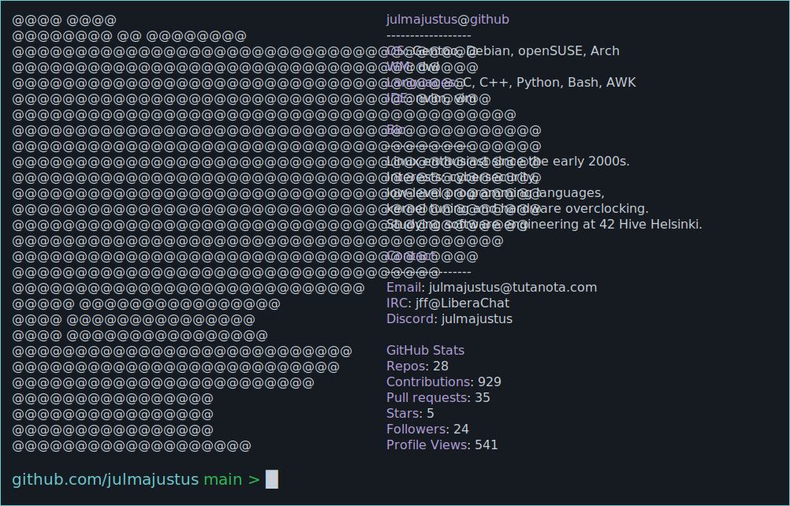

<!-- MY NEOFETCH-STYLE README -->
<a href="https://github.com/julmajustus/julmajustus">
  <picture>
    
  </picture>
</a>

## Repo overview

<strong>Code that I actually use</strong>

## btrtile — A Focus-Driven Tiling Layout for dwl

btrtile is a dynamic, focus-aware tiling layout patch for the [dwl](https://codeberg.org/dwl/dwl) window manager. Tailored for ultrawide monitors and flexible workflows, it utilizes a binary tree structure to divide the screen based on your pointer’s position relative to the active client. This intelligent layout automatically chooses vertical or horizontal splits and offers both keyboard and mouse controls for precise resizing and client management.

[More detailed description in project repo](https://codeberg.org/dwl/dwl-patches/src/branch/main/patches/btrtile)

---

## simple_scratchpad — A Minimalist Scratchpad Utility for dwl

simple_scratchpad is a lightweight utility patch for the [dwl](https://codeberg.org/dwl/dwl) window manager that streamlines your workspace by allowing you to quickly hide and reveal clients on demand. By enabling a simple command to add, toggle, or remove windows from a scratchpad list, it helps keep your desktop uncluttered while preserving the state of auxiliary applications for later use.

[More detailed description in project repo](https://codeberg.org/dwl/dwl-patches/src/branch/main/patches/simple_scratchpad)

---

## fullscreenadaptivesync — Adaptive Sync for Fullscreen Clients in dwl

fullscreenadaptivesync enhances the visual experience on the [dwl](https://codeberg.org/dwl/dwl) window manager by automatically toggling adaptive sync (VRR) when an application goes fullscreen. This patch detects fullscreen transitions and enables VRR to provide a smoother, tear-free display experience—then disables it when you exit fullscreen—to help minimize flickering and maintain performance. It’s an ideal solution for users with VRR-capable monitors looking for seamless adaptive sync integration.

[More detailed description in project repo](https://codeberg.org/dwl/dwl-patches/src/branch/main/patches/fullscreenadaptivesync)

---

## Mini Benchmark Scraper — Linux System Benchmark Visualizer

Mini Benchmark Scraper is a Python script that automates the extraction, parsing, and visualization of benchmark data from [Mini Benchmarker](https://gitlab.com/torvic9/mini-benchmarker) log files. It processes multiple log files, computes averages across different benchmark modes for each kernel version, and generates comparison bar charts embedded in an HTML page for easy analysis.

Used also in [Cachyos-benchmarker](https://github.com/CachyOS/cachyos-benchmarker)

[More detailed description in project repo](https://github.com/julmajustus/mini-benchmark-scraper)

---

<strong>Educational projects</strong>

## cub3d - Wolfenstein3D/DOOM-Inspired Zombie Shooter

cub3d is a zombie shooter written in C that draws inspiration from classic titles like Wolfenstein 3D and DOOM. It employs raycasting and the DDA algorithm to create a pseudo-3D experience.

[More detailed description in project repo](https://github.com/julmajustus/cub3d)

---

## minishell - As Beautiful as a Shell

minishell is a custom shell implemented in C as part of our group project. It replicates many features of bash, providing an interactive command-line environment with robust error handling, built-in commands, redirections, pipes, and more.

[More detailed description in project repo](https://github.com/julmajustus/minishell)

---

## fract’ol - Computer Graphics Fractals

fract’ol is a visually captivating fractal renderer built in C using the MLX42 library. It showcases a variety of fractals—including the Julia, Mandelbrot, and Multibrot sets—bringing computer graphics to life.

[More detailed description in project repo](https://github.com/julmajustus/fractol)

---

## philosophers - Dining Philosophers Problem

philosophers is a C project that demonstrates the classic Dining Philosophers Problem, a common exercise in concurrent programming. It features two solutions:

   - Pthreads Implementation: Uses threads and mutexes.
   - Bonus (Semaphores & Processes): Uses processes and semaphores.

[More detailed description in project repo](https://github.com/julmajustus/philosophers)

---

## push_swap - Optimized Sorting with a Greedy Approach

Sorting is a fundamental skill every developer should master. This project challenges you to implement an efficient sorting algorithm in C while getting hands-on with algorithmic complexity. Instead of traditional linked lists, this solution uses circular arrays to represent stacks, offering an alternative perspective on data structure design.

[More detailed description in project repo](https://github.com/julmajustus/push_swap)

---

## pipex - Command Piping in C

pipex is a C project that replicates shell command piping. It demonstrates how to create child processes, manage file descriptors, and set up pipelines to emulate shell behavior.

[More detailed description in project repo](https://github.com/julmajustus/pipex)

---

## libft - A Partial glibc Reimplementation in C

A custom reimplementation of key GNU C Library (glibc) functions written in C. This project serves as both a learning exercise and a reusable library, providing you with a deeper understanding of low-level operations, memory management, string manipulation, and basic data structures.

[ft_printf](https://github.com/julmajustus/ft_printf)  
[libft](https://github.com/julmajustus/libft)

---

