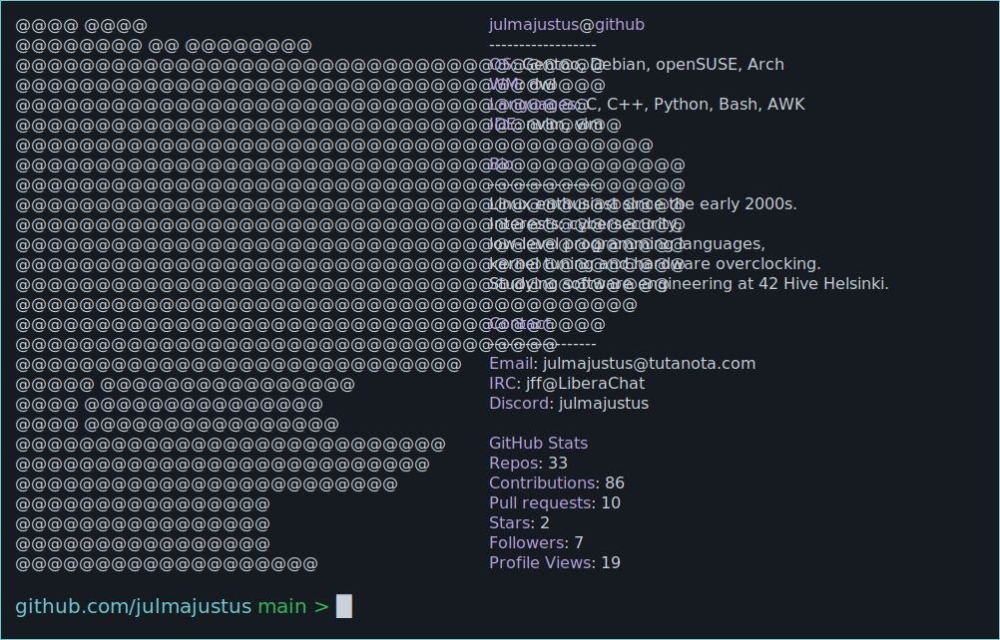

<!-- MY NEOFETCH-STYLE README -->
<a href="https://github.com/julmajustus/julmajustus">
  <picture>
    
  </picture>
</a>

<strong>Repo overview</strong>

Code that I use daily

### btrtile — A Focus-Driven Tiling Layout for dwl.

btrtile is a dynamic tiling layout patch designed for the [dwl](https://codeberg.org/dwl/dwl) window manager. It provides a focus-driven, mouse- and keyboard-friendly tiling layout that grants you granular control over how clients are placed and resized.

[More detailed description in project repo](https://codeberg.org/dwl/dwl-patches/src/branch/main/patches/btrtile)

---

### simple_scratchpad — A very simple scratchpad utility.

Simple scratchpad utility for the [dwl](https://codeberg.org/dwl/dwl) window manager.  
Adds functionality to hide/show clients.

[More detailed description in project repo](https://codeberg.org/dwl/dwl-patches/src/branch/main/patches/simple_scratchpad)

---

### fullscreenadaptivesync — Enables adaptive sync/VRR when a client is fullscreen.

Enchanges the VRR experience for the [dwl](https://codeberg.org/dwl/dwl) window manager.  

[More detailed description in project repo](https://codeberg.org/dwl/dwl-patches/src/branch/main/patches/fullscreenadaptivesync)

Educational projects

### cub3d - Wolfenstein3D/DOOM inspired zombie shooter.

Zombie shooter written in C utilizes raycasting, DDA algorithm.

[More detailed description in project repo](https://github.com/julmajustus/cub3d)

---

### minishell - Linux shell written in C.

Bash styled shell which handles most common shell builtins, command piping, "&&"/"||" operators and wildcards.

[More detailed description in project repo](https://github.com/toagne/minishell)

---

### fract’ol - Computer Graphics Fractals.

Draws beatiful fractals utilizing MLX42 library.  
Handles Julia, Mandelbrot and Multibrot sets.  

[More detailed description in project repo](https://github.com/julmajustus/Hive/tree/main/fractol)

---

### philosophers - Dining philosophers problem.

Solving commong programming dilemma with threads and processes.
Written in C utilizing pthread mutexes and semaphores.

[More detailed description in project repo](https://github.com/julmajustus/Hive/tree/main/philosophers)

---

### push_swap - finding most efficient sorting algorithm.

Sorting numbers with a frankenstein algorithm. Written in C.

[More detailed description in project repo](https://github.com/julmajustus/Hive/tree/main/push_swap)

---

### libft - Partial rewrite of glibc with bunch of extra on top.

[ft_printf](https://github.com/julmajustus/Hive/tree/main/ft_printf)  
[get_next_line](https://github.com/julmajustus/Hive/tree/main/get_next_line)  
[libft](https://github.com/julmajustus/Hive/tree/main/libft)

---

